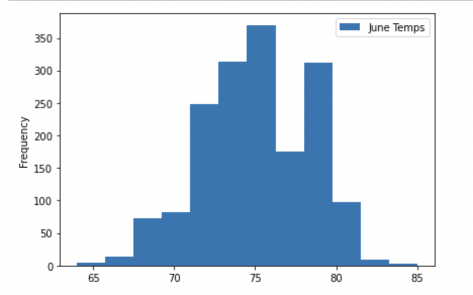
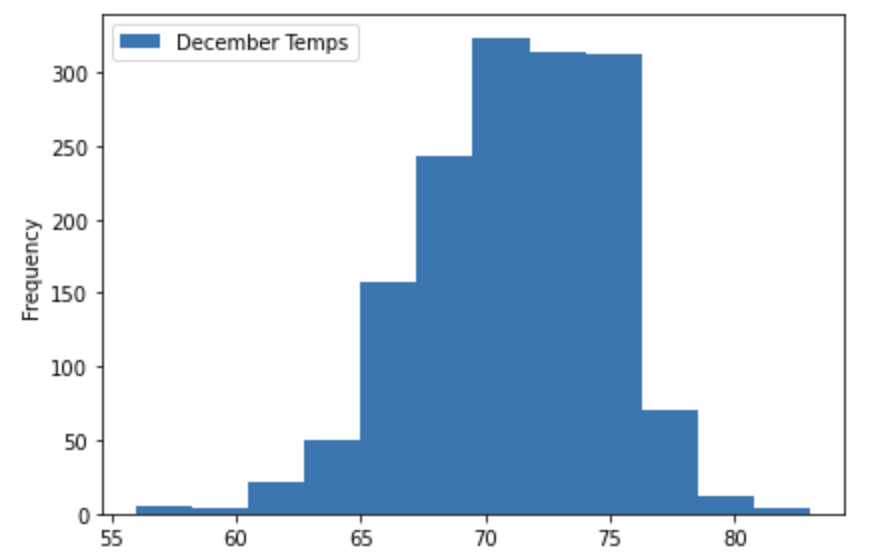

# Surfs Up
## Climate analysis for a surf and ice cream shop business venture in Oahu, Hawaii
### Overview
This analysis includes a comparison of temperature data from June and December in Oahu in order to determine the feasibility of keeping the business open year round. In order to complete this analysis, weather data from multiple years was uploaded to Jupyter Notebook in order to use Python and Sqlalchemy to filter the data by specific months and put that data into seperate data frames. Then, a statistical analysis was performed on the data frames in order to compare the data between the two months.

### Results
The results of the statistical analysis for June and December are below:

 

- Despite the mean temperature for December being almost 4 degrees lower than June, both mean tempatures are in the 70s, which is great weather for surfing and ice cream.
- One concern with December weather is that the temperature at the 25% percentile is lower than 70 degrees, which means there will certainly be days that may be too cold to draw customers. The 25% percentile for June is still above 70 degrees.
- While the max temps for June and Dec are only two degrees depart (83 degrees for Dec and 85 for June), there is a bigger difference when it comes to min temps. The difference there is 8 degrees, with a chilly 56 degrees for December and a milder 64 for June.
- Overall, June has a larger frequency of days above 80 degrees compared to December.
- Both months have low standard deviations and temperatures are largely centered around the mean, suggesting that there is not a large variation in tempature during these months. Plots of the data are below:

 

### Summmary 

#### Should the shop remain open?
Based on the temperature analysis, keeping the surf and ice cream shop open year round is definitely possible. With mean temperatures in the 70s with little extreme variation in temperature, the temperature in Oahu in both summer and winter is pretty consistent. While colder days in December can be expected, the average temperature is definitely promising for keeping customers interested in the shop in the winter months. There may also be an influx of tourists around the holidays in December, which could be a boost to the shops overall revenue if they were to stay open. 

#### Additional queries to consider
1. While temperature is an important consideration in terms of considering the shop's potential year round, another important element is precipitation. Comparing the amount of precipitation between the two months could provide helpful information for how many good beach days the shop can expect in summer vs. winter.
2. Beyond precipitation, the shop owners should also consider the number of sunny days per month. Cloudy days may not draw as many ice cream lovers as sunny days, and there may be less beachgoers in general who would be interested in trying an afternoon of surfing.
3. The shop owners should also comparing all months vs. just taking a sampling of two months. There may be suprising results for precipitation, cloudy days, and temperature for months they may not have even considered being an issue. The shop owners should let the full data picture inform their decisions vs. limiting their data set too early on in their research.

